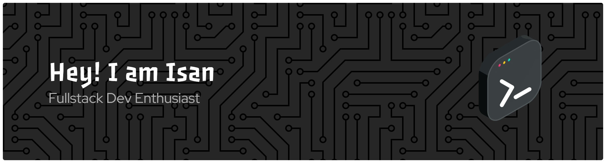

🚀 **Information Systems Student | UI/UX & Mobile Developer | Web Developer**

---

### About Me

- 🎓 Student at **STMIK Triguna Dharma** (Information Systems)
- 💻 Interested in **Mobile Development**, **Web Development**, and **UI/UX Design**
- 📊 Passionate about technology, data, and creating impactful projects
- 🎸 In my free time, I play guitar and enjoy gaming

---

### Skills

---

### Connect With Me

  

<!--
**Ikhzmi/Ikhzmi** is a ✨ _special_ ✨ repository because its `README.md` (this file) appears on your GitHub profile.

Here are some ideas to get you started:

- 🔭 I’m currently working on ...
- 🌱 I’m currently learning ...
- 👯 I’m looking to collaborate on ...
- 🤔 I’m looking for help with ...
- 💬 Ask me about ...
- 📫 How to reach me: ...
- 😄 Pronouns: ...
- ⚡ Fun fact: ...
-->
